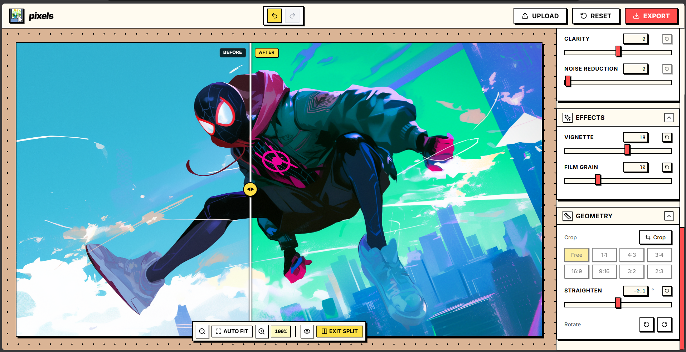
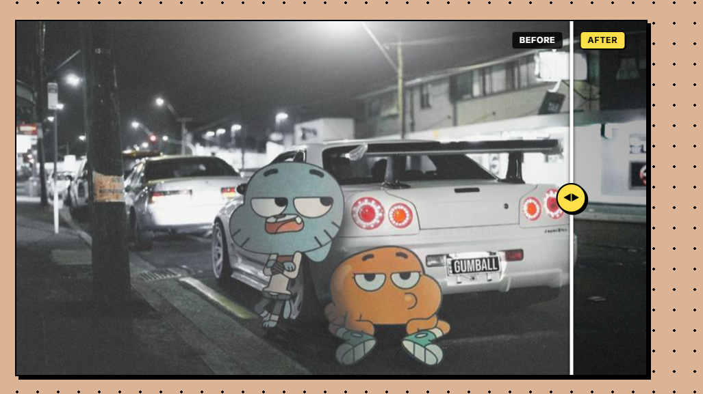
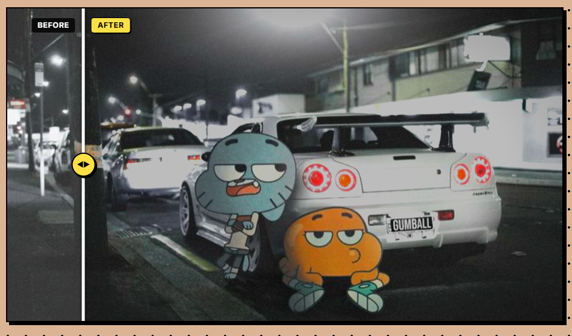

# pixels 🎨

**pixels** is a modern, high-performance web photo editor with a nostalgic soul. Built with a distinctive **Neo-Brutalist / Retro Paint App** aesthetic, it combines pro-grade image editing features with playful, tactile design.

<div align="center">
  <br />
  
  <p><em>Preview: The editor in action with Before/After Split View</em></p>
  <br />

  <table>
    <tr>
      <td align="center">
        
      </td>
      <td align="center">
        
      </td>
    </tr>
  </table>
  <br />
</div>

---

## ✨ Features

### 🔀 Before & After Split Slider
- **Real-Time Split Comparison**: Interactive, draggable slider bar across your image to compare original vs edited photos at 60fps.
- **Hold to Compare**: Quick-peek **Eye** icon button to instantly view the unedited original.

### 🔍 Auto-Fit & Dynamic Zoom
- **Smart Auto-Fit**: Automatically sizes and centers any uploaded or cropped photo with optimal margins.
- **Deep Zoom & Pan**: Smooth mouse-wheel zoom, pan navigation, and zoom level indicator (with 1-click 100% reset).

### 📐 Geometry & Free Crop
- **8-Direction Free Crop**: Drag any of the 8 gold handles (corners and edge midpoints) or drag the crop box directly.
- **Preset Aspect Ratios**: Free, 1:1 (Square), 4:3, 3:4, 16:9, 9:16, 3:2, and 2:3.
- **Straighten & Rotation**: Smooth straighten angle slider with auto-zoom bounding and 90° clockwise/counter-clockwise rotation.

### ☀️ Light & Tone Adjustments
- **Exposure**: Photographic luminance adjustment.
- **Brilliance**: Smart midtone punch and dynamic contrast.
- **Highlights & Shadows**: Detail recovery in bright skies and shadow regions.
- **Contrast & Brightness**: Fine-tuned dynamic range control.
- **Black Point**: Precise dark tone depth and shadow crushing.

### 🎨 Color & White Balance
- **Natural Temperature**: Warm golden-hour glow or cool daylight balance.
- **Tint**: Subtle green-to-magenta hue correction.
- **Saturation & Vibrance**: Rich color boost with skin-tone protection.

### ✨ Detail & Retro Effects
- **Clarity & Noise Reduction**: Local contrast enhancement and bilateral smoothing.
- **Optical Vignette**: Radial gradient with smooth, natural quadratic edge falloff.
- **Procedural Film Grain**: Authentic analog film texture with overlay blending.

### ⚡ AI Tools
- **Auto Enhance**: Intelligent histogram equalization combined with Gray-World auto white-balance estimation in a single click.

### ↩️ Robust Undo / Redo
- **Full History Tracking**: Revert any edit, global reset, or crop operation.
- **Keyboard Shortcuts**:
  - `Ctrl + Z` / `Cmd + Z`: Undo
  - `Ctrl + Y` / `Ctrl + Shift + Z` / `Cmd + Shift + Z`: Redo

### 💾 High-Fidelity Export
- Export to **JPEG** (with adjustable quality compression) or lossless **PNG**.
- Accurately renders crop, rotation, straighten, all filter adjustments, optical vignette, and procedural film grain.

---

## 🛠️ Tech Stack

- **Framework**: [Next.js 14](https://nextjs.org/) (App Router)
- **Language**: TypeScript
- **Styling**: Tailwind CSS & Custom CSS variables (Neo-Brutalism theme)
- **State Management**: Zustand
- **Canvas Engine**: React Konva & Konva.js
- **Animations**: Framer Motion
- **Icons**: Lucide React

---

## 🚀 Getting Started

1. **Clone the repository:**
   ```bash
   git clone https://github.com/notsomohit/pixels.git
   cd pixels
   ```

2. **Install dependencies:**
   ```bash
   npm install
   ```

3. **Run the development server:**
   ```bash
   npm run dev
   ```

4. **Open the editor:**
   Navigate to [http://localhost:3000](http://localhost:3000) in your browser.

---

## 📄 License

MIT License.
